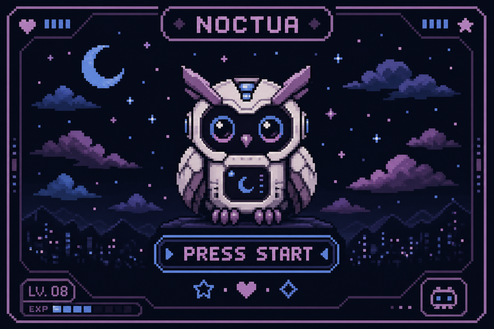

# 👾 SYSTEM INITIALIZED: NOCTUA PRIME 👾

**"A wise owl once said: '01101000 01101111 01101111 01110100'."**

---

## 🕹️ CHOOSE YOUR QUEST

| Quest | Reward | Status |
|---|---|---|
| 🌌 **Noctua-Niri** | Ultimate UI/UX Mastery | `COMPLETED` |
| 🤖 **ArbiterAI** | Autonomous Local Intelligence | `ACTIVE` |
| 🦀 **Voidkitty-LLM** | Sovereign Inference | `LEVELING` |
| 🔐 **Noctua-Material** | Fluid Login Aesthetics | `COMPLETED` |

---

## 🛠️ CHARACTER STATS

**STR (Infrastructure):** Docker, Linux, Niri, Shell Scripting.  
**INT (Logic):** Python, TypeScript, Rust, AI Orchestration.  
**DEX (Visuals):** QML, Tailwind CSS, Glassmorphism, Pixel Art.  
**LUK (Open Source):** Finding the perfect config in one try.

---

## 🎒 INVENTORY

---

## 📈 XP PROGRESS

---

### 💾 SAVE GAME?

[**[ YES ]**](mailto:38922657+NoctuaCoder@users.noreply.github.com) &nbsp;&nbsp;&nbsp;&nbsp; [**[ NO ]**](https://github.com/NoctuaCoder)

