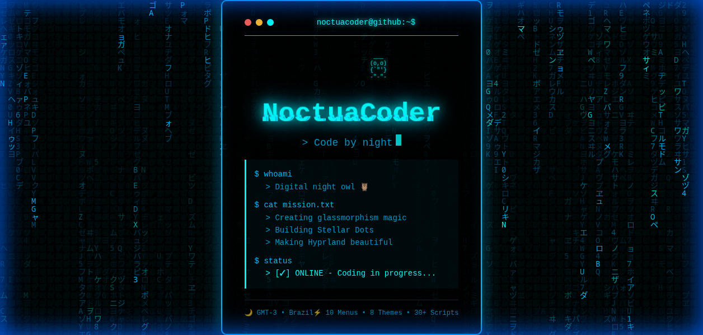

<!-- Header with Name -->
<h1 style="font-size: 3.5em; font-weight: 300; letter-spacing: 2px; margin-bottom: 5px; color: #E0FFFF;">NoctuaCoder</h1>

  

<!-- Matrix Owl Interactive Preview -->

  ✨ <strong>Click to experience the interactive Matrix Owl terminal</strong> ✨

 

<!-- Main Bento Grid -->
<table width="100%" cellspacing="15">
<tr>

<!-- LEFT COLUMN -->
<td width="35%" valign="top">

<!-- Profile Card -->

  

    ⭐
    ✨
    ⭐
    ✨
    
  

  <h3 style="margin: 0 0 10px 0; font-size: 1.3em; color: #0A0E27;">Hello, I'm <strong>Alana</strong></h3>
  
" Passionate developer driven by creativity & learning! "

<!-- Education Card -->

<h3 style="color: #00FFFF; margin-top: 0; font-size: 1.2em;">🎓 Education</h3>

  
<strong>Computer Science</strong>

  
Self-taught Developer

  
2020 - Present

<!-- Skills Card -->

<h3 style="color: #00FFFF; margin-top: 0; font-size: 1.2em;">💻 Designing Skills</h3>

UI/UX Design, Figma, Framer, UX Research

<h3 style="color: #00FFFF; margin-top: 20px; font-size: 1.2em;">⚡ Software Skills</h3>

Shell Script, Python, JavaScript, HTML, CSS, Rust, React.js

</td>

<!-- RIGHT COLUMN -->
<td width="65%" valign="top">

<!-- Featured Work Card -->

  <h2 style="color: #E0FFFF; margin: 0; font-size: 1.5em;">Featured Work</h2>
  <a href="https://github.com/NoctuaCoder?tab=repositories" style="color: #00FFFF; text-decoration: none; font-size: 0.9em;">View Projects ↗</a>

<!-- Project Grid -->
<table width="100%" cellspacing="10">
<tr>
<td width="50%" valign="top">

<!-- Project 1 -->

  

    <h3 style="margin: 0; color: #0A0E27; font-size: 1.1em;">🌟 Stellar Dots</h3>
  

  
Premium Glassmorphism collection for Hyprland with 10+ menus & 30+ scripts

  

    
  

</td>
<td width="50%" valign="top">

<!-- Project 2 -->

  

    <h3 style="margin: 0; color: #0A0E27; font-size: 1.1em;">📊 Dashboard Pro</h3>
  

  
Modern analytics dashboard with real-time data visualization

  

    
  

</td>
</tr>
<tr>
<td colspan="2">

<!-- Project 3 - Wide -->

  <table width="100%">
  <tr>
  <td width="70%">
    <h3 style="color: #00FFFF; margin: 0 0 10px 0; font-size: 1.1em;">🎨 Design System</h3>
    
Comprehensive UI component library with modern aesthetics

  </td>
  <td width="30%" align="right" valign="middle">
    

      
3%

      
Increase

    

  </td>
  </tr>
  </table>

</td>
</tr>
</table>

<!-- Stats & Social Section -->
<table width="100%" cellspacing="15">
<tr>

<!-- GitHub Stats -->
<td width="60%" valign="top">

  

</td>

<!-- Social Links -->
<td width="40%" valign="top">

  
  

    
  

  
  

    
  

  
  

    
  

  
  

    <a href="https://github.com/NoctuaCoder" style="background: linear-gradient(135deg, #00BFFF 0%, #00FFFF 100%); color: #0A0E27; padding: 12px 30px; border-radius: 25px; text-decoration: none; font-weight: bold; display: inline-block; box-shadow: 0 4px 15px rgba(0, 191, 255, 0.4);">
      Resume ↗
    </a>
  

</td>

</tr>
</table>

</td>

</tr>
</table>

 

---

 

<!-- Footer -->

✨ Crafted with passion • © 2025 NoctuaCoder

