<div align="center">



[](https://github.com/NoctuaCoder)
[](https://github.com/NoctuaCoder)
[](https://noctuacoder.github.io/NoctuaCoder/portfolio.html)

**✨ Crafting celestial experiences through code ✨**

[🌐 Portfolio](https://noctuacoder.github.io/NoctuaCoder/portfolio.html) • [🚀 Featured Project](#-featured-project) • [💡 What I Build](#-what-i-build) • [🛠️ Tech Stack](#️-tech-stack)

</div>

---

## 🚀 Featured Project

<div align="center">

### **ArbiterAI v5.0** - The Docker for AI Code Agents

[](https://github.com/NoctuaCoder/ArbiterAI)

</div>

**Production Ready** ✅ | **100% Local** 🔒 | **Open Source** 🌍

The **ONLY** platform combining:

<table>
<tr>
<td width="50%">

✅ **Real Code Execution**  
✅ **Docker Container Isolation**  
✅ **Plugin Extensibility**

</td>
<td width="50%">

✅ **Git Workflow Integration**  
✅ **Zero API Costs**  
✅ **MIT Licensed**

</td>
</tr>
</table>

> 🔥 **Why ArbiterAI?** Build autonomous AI agents that can execute real code safely in isolated Docker containers. Perfect for developers who want full control without cloud dependencies.

---

## 💡 What I Build

<table>
<tr>
<td width="33%" align="center">

### 🤖 AI & Automation

**Autonomous agents** that execute real code  
**LLM-powered** development tools  
**Plugin systems** for unlimited extensibility

</td>
<td width="33%" align="center">

### 🔒 Security-First

**Docker sandboxing** for safe execution  
**Enterprise-grade** isolation  
**Resource limits** and validation

</td>
<td width="33%" align="center">

### 🌍 Open Source

Building tools the **community** can extend  
**100% transparent** development  
**MIT licensed** with attribution

</td>
</tr>
</table>

---

## 🛠️ Tech Stack

<div align="center">

### Languages & Frameworks


### AI & ML


### Infrastructure


### Tools


</div>

---

## 📊 GitHub Stats

<div align="center">


</div>

---

## 🎯 Current Focus

<div align="center">

```
┌─────────────────────────────────────────────────────────────┐
│                                                             │
│  🔌  Building plugin ecosystem for ArbiterAI               │
│  🎨  Enhancing UX for autonomous agents                    │
│  📚  Creating developer documentation                       │
│  🌐  Growing open source community                         │
│                                                             │
└─────────────────────────────────────────────────────────────┘
```

</div>

---

## 🌟 Featured Projects

<div align="center">

| Project | Description | Tech Stack | Link |
|---------|-------------|------------|------|
| 🤖 **ArbiterAI** | Docker for AI Code Agents | Python, Docker, FastAPI | [View →](https://github.com/NoctuaCoder/ArbiterAI) |
| ✨ **Stellar Dots** | Premium Hyprland dotfiles | Bash, Hyprland, Waybar | [View →](https://github.com/NoctuaCoder/stellar-dots) |
| 🎯 **Noctua Command Center** | Productivity dashboard | HTML, CSS, JavaScript | [View →](https://github.com/NoctuaCoder/noctua-command-center) |
| 💬 **Noctua Assistant** | Portfolio chatbot | JavaScript, NLP | [View →](https://github.com/NoctuaCoder/noctua-assistant) |
| 🦉 **Matrix Owl** | Interactive terminal | HTML, Canvas, JavaScript | [View →](https://noctuacoder.github.io/matrix-owl/) |

</div>

---

## 💬 Let's Connect

<div align="center">

[](https://github.com/NoctuaCoder)
[](https://noctuacoder.github.io/NoctuaCoder/portfolio.html)
[](mailto:38922657+NoctuaCoder@users.noreply.github.com)

</div>

---

<div align="center">

### 💫 Philosophy

```
╔═══════════════════════════════════════════════════════════════╗
║                                                               ║
║  "Code that executes itself.                                 ║
║   AI that builds autonomously.                               ║
║   Future that's open source."                                ║
║                                                               ║
╚═══════════════════════════════════════════════════════════════╝
```

<br>

⭐ **Star [ArbiterAI](https://github.com/NoctuaCoder/ArbiterAI) if you believe in autonomous development!**

<br>


<br>

Made with 💙 and ✨ under the celestial sky

**[⬆ back to top](#)**

</div>
