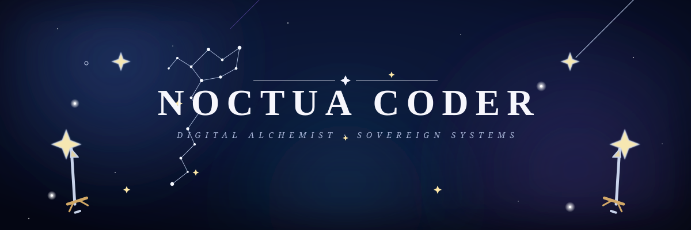

# 🌌 CELESTIAL DASHBOARD: NOCTUA PRIME 🌌

**Digital Alchemist | Sovereign Systems Architect | Local Intelligence Specialist**

*"Crafting uncompromising Linux environments and autonomous local intelligence under the starlit sky."*

---

## 🔭 PROJECT CONSTELLATIONS

The core pillars of the Noctua ecosystem, designed for complete ownership and aesthetic excellence.

| Constellation | Purpose | Status |
|---|---|---|
| 🌌 **noctua-niri** | Ultimate Niri compositor suite with Quickshell UI & Native Services | `SOVEREIGN` |
| 🤖 **ArbiterAI** | Docker-isolated autonomous local code agent runtime | `ACTIVE` |
| 🦀 **voidkitty-llm** | Local LLM management and GGUF inference engine | `STABLE` |
| 🔐 **noctua-material** | Mobile-inspired Material You SDDM login environment | `STABLE` |

---

## 🛠️ CORE COMPETENCIES

**Sovereign Infrastructure**  
Specializing in ephemeral Docker sandboxing, Linux kernel-level customization, and Niri-first tiling compositor architectures.

**Local Intelligence**  
Orchestrating autonomous agents with Ollama and custom Python frameworks to ensure zero cloud dependency and maximum privacy.

**Visual Alchemy**  
Mastering QML, Tailwind CSS, and advanced Glassmorphism to create 'Reddit-ready' interfaces that bridge the gap between beauty and performance.

---

## 🎒 TECHNICAL ARSENAL

---

## 📈 SYSTEM TELEMETRY

---

### 📡 CONTACT FREQUENCY

