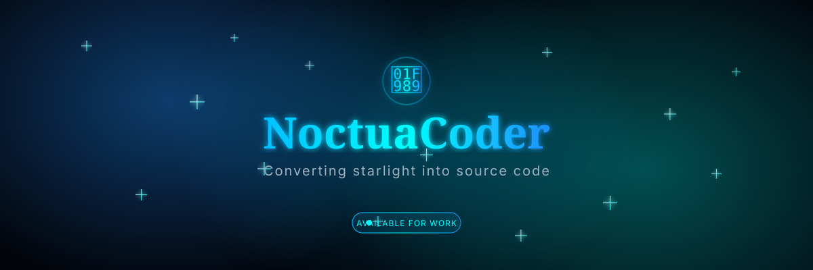

**Building tools I actually use — AI agents, local LLMs, and a Hyprland rice that works.**

---

## Featured

| Project | What it is | Stack |
|---|---|---|
| 🤖 [**ArbiterAI**](https://github.com/NoctuaCoder/ArbiterAI) | Docker-isolated AI code agent runtime | Python · Docker · FastAPI |
| 🦀 [**voidkitty-llm**](https://github.com/NoctuaCoder/voidkitty-llm) | Local LLM manager — pull, list, run GGUF models | Rust · llama.cpp |
| 🌌 [**noctua-hypr**](https://github.com/NoctuaCoder/noctua-hypr) | Hyprland rice — Quickshell, installer, themes | Bash · QML · Hyprland |

---

## What I build

**AI & local inference** — autonomous agents that run real code in Docker; a Rust CLI to manage GGUF models through llama.cpp without cloud dependencies.

**Linux tooling** — a Hyprland rice with a full QML shell (bar, launcher, notifs, lockscreen, sidebar), an interactive installer, and an LLM widget that talks to voidkitty-llm.

**The thread:** everything runs locally, owned completely.

---

## Stack

---

## Stats

---

